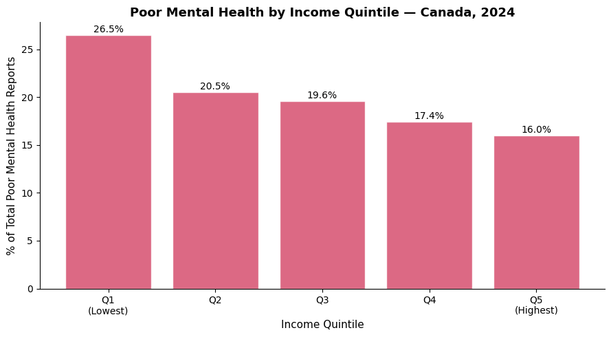
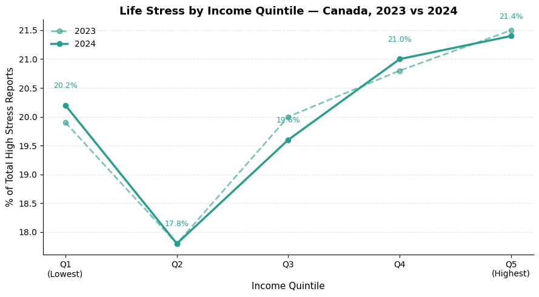
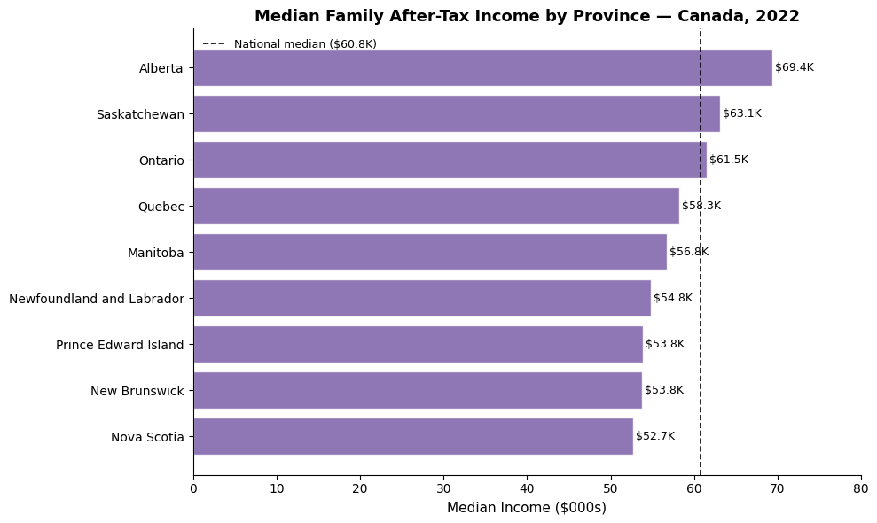

# Public Health Data Analysis: Income and Mental Health in Canada

**Margaret Medleva | Public Health, University of Waterloo**

After taking a Social Determinants of Health course, I became curious about the relationship between income and mental health in Canada. With the economy becoming increasingly difficult for many Canadians and learning about how stress impacts health, I wanted to explore how significant income is to mental health. I found a dataset from Statistics Canada and decided to analyze it and apply what I learned from my public health, statistics, and health informatics courses.

**Data Sources:**
- Statistics Canada, Table 13-10-0906-01: Health indicator statistics by household income quintile (CCHS 2023–2024)
- Statistics Canada: Median family after-tax income by province (2019–2022)

**Research Questions:**
1. Do lower income groups report worse mental health?
2. How did stress levels vary between 2023 and 2024 across income groups?
3. How do median incomes compare across Canadian provinces?

---
## 1. Imports


```python
import pandas as pd
import matplotlib.pyplot as plt
```

---
## 2. Loading + Cleaning the Data


```python
# reading mental health csv as a table, skipping 10 rows from top
mental = pd.read_csv(
    'mental_health.csv',
    skiprows = 10,
    encoding = 'latin1'
)

# First column has no title, renaming to 'indicator'
cols = list(mental.columns)
cols[0] = 'Indicator'
mental.columns = cols

# view data
mental.head(5)
```


<div>
<style scoped>
    .dataframe tbody tr th:only-of-type {
        vertical-align: middle;
    }

    .dataframe tbody tr th {
        vertical-align: top;
    }

    .dataframe thead th {
        text-align: right;
    }
</style>
<table border="1" class="dataframe">
  <thead>
    <tr style="text-align: right;">
      <th></th>
      <th>Indicator</th>
      <th>Number of persons</th>
      <th>Unnamed: 2</th>
      <th>Number of persons.1</th>
      <th>Unnamed: 4</th>
      <th>Number of persons.2</th>
      <th>Unnamed: 6</th>
      <th>Number of persons.3</th>
      <th>Unnamed: 8</th>
      <th>Number of persons.4</th>
      <th>Unnamed: 10</th>
      <th>Number of persons.5</th>
      <th>Unnamed: 12</th>
      <th>Number of persons.6</th>
      <th>Unnamed: 14</th>
      <th>Number of persons.7</th>
      <th>Unnamed: 16</th>
    </tr>
  </thead>
  <tbody>
    <tr>
      <th>0</th>
      <td>Indicators</td>
      <td>2023</td>
      <td>2024</td>
      <td>2023</td>
      <td>2024</td>
      <td>2023</td>
      <td>2024</td>
      <td>2023</td>
      <td>2024</td>
      <td>2023</td>
      <td>2024</td>
      <td>2023</td>
      <td>2024</td>
      <td>2023</td>
      <td>2024</td>
      <td>2023</td>
      <td>2024</td>
    </tr>
    <tr>
      <th>1</th>
      <td>NaN</td>
      <td>Number</td>
      <td>NaN</td>
      <td>NaN</td>
      <td>NaN</td>
      <td>NaN</td>
      <td>NaN</td>
      <td>NaN</td>
      <td>NaN</td>
      <td>NaN</td>
      <td>NaN</td>
      <td>NaN</td>
      <td>NaN</td>
      <td>NaN</td>
      <td>NaN</td>
      <td>NaN</td>
      <td>NaN</td>
    </tr>
    <tr>
      <th>2</th>
      <td>Perceived mental health, very good or excellen...</td>
      <td>3,107,300</td>
      <td>3,106,700</td>
      <td>3,301,800</td>
      <td>3,315,000</td>
      <td>3,278,400</td>
      <td>3,455,900</td>
      <td>3,347,900</td>
      <td>3,616,500</td>
      <td>3,549,000</td>
      <td>3,722,900</td>
      <td>660,200</td>
      <td>656,400</td>
      <td>1,997,400</td>
      <td>2,026,800</td>
      <td>10,338,900</td>
      <td>11,015,400</td>
    </tr>
    <tr>
      <th>3</th>
      <td>Perceived mental health, fair or poor 13</td>
      <td>1,159,700</td>
      <td>1,279,200</td>
      <td>922,400</td>
      <td>989,100</td>
      <td>897,200</td>
      <td>946,600</td>
      <td>841,100</td>
      <td>839,600</td>
      <td>819,300</td>
      <td>773,700</td>
      <td>206,400</td>
      <td>194,200</td>
      <td>622,400</td>
      <td>627,700</td>
      <td>2,953,000</td>
      <td>3,104,200</td>
    </tr>
    <tr>
      <th>4</th>
      <td>Perceived life stress, most days quite a bit o...</td>
      <td>1,385,800</td>
      <td>1,496,700</td>
      <td>1,239,800</td>
      <td>1,316,400</td>
      <td>1,392,500</td>
      <td>1,449,600</td>
      <td>1,451,600</td>
      <td>1,559,100</td>
      <td>1,500,800</td>
      <td>1,587,100</td>
      <td>213,100</td>
      <td>174,500</td>
      <td>765,100</td>
      <td>778,800</td>
      <td>4,243,200</td>
      <td>4,594,600</td>
    </tr>
  </tbody>
</table>
</div>


```python
# reading the income file, skipping 1 row
income = pd.read_csv(
    'income.csv',
    skiprows = 1,
    nrows = 11,
    encoding = 'latin1'
)

# renaming columns 
income.columns = ['Province', '2019', '2020', '2021', '2022', 'Change_21_22', 'Change_19_22']

# clean up province names
income['Province'] = income['Province'].str.strip()

# make income columns numeric
for col in ['2019', '2020', '2021', '2022']:
    income[col] = pd.to_numeric(income[col], errors='coerce')

# drop empty rows
income = income.dropna(subset=['Province', '2022'])

income.head()
```


<div>
<style scoped>
    .dataframe tbody tr th:only-of-type {
        vertical-align: middle;
    }

    .dataframe tbody tr th {
        vertical-align: top;
    }

    .dataframe thead th {
        text-align: right;
    }
</style>
<table border="1" class="dataframe">
  <thead>
    <tr style="text-align: right;">
      <th></th>
      <th>Province</th>
      <th>2019</th>
      <th>2020</th>
      <th>2021</th>
      <th>2022</th>
      <th>Change_21_22</th>
      <th>Change_19_22</th>
    </tr>
  </thead>
  <tbody>
    <tr>
      <th>1</th>
      <td>Canada</td>
      <td>60760.0</td>
      <td>65170.0</td>
      <td>63320.0</td>
      <td>60800.0</td>
      <td>-4.0</td>
      <td>0.1</td>
    </tr>
    <tr>
      <th>2</th>
      <td>Newfoundland and Labrador</td>
      <td>55600.0</td>
      <td>58850.0</td>
      <td>57780.0</td>
      <td>54820.0</td>
      <td>-5.1</td>
      <td>-1.4</td>
    </tr>
    <tr>
      <th>3</th>
      <td>Prince Edward Island</td>
      <td>53930.0</td>
      <td>58130.0</td>
      <td>56890.0</td>
      <td>53830.0</td>
      <td>-5.4</td>
      <td>-0.2</td>
    </tr>
    <tr>
      <th>4</th>
      <td>Nova Scotia</td>
      <td>53290.0</td>
      <td>57460.0</td>
      <td>55870.0</td>
      <td>52730.0</td>
      <td>-5.6</td>
      <td>-1.1</td>
    </tr>
    <tr>
      <th>5</th>
      <td>New Brunswick</td>
      <td>53930.0</td>
      <td>57940.0</td>
      <td>56230.0</td>
      <td>53800.0</td>
      <td>-4.3</td>
      <td>-0.2</td>
    </tr>
  </tbody>
</table>
</div>


---
## 3. Organizing Data

I'm pulling out numbers I need for poor mental health and life stress across each income quintile for 2023 and 2024. 


```python
# income quintile labels
quintiles = ['Q1 (Lowest)', 'Q2', 'Q3', 'Q4', 'Q5 (Highest)']

# poor mental health counts by quintile

# from row: "Perceived mental health, fair or poor"
# columns alternate: Q1_2023, Q1_2024, Q2_2023, Q2_2024 ...
poor_mh_2023 = [1159700, 922400, 897200, 841100, 819300]
poor_mh_2024 = [1279200, 989100, 946600, 839600, 773700]

# life stress counts by quintile
# from row: "Perceived life stress, most days quite a bit or extremely stressful"
stress_2023 = [1385800, 1239800, 1392500, 1451600, 1500800]
stress_2024 = [1496700, 1316400, 1449600, 1559100, 1587100]

# calculating percentage share for each quintile
total_mh_2024 = sum(poor_mh_2024)
pct_mh_2024 = [round(x / total_mh_2024 * 100, 1) for x in poor_mh_2024]

total_mh_2023 = sum(poor_mh_2023)
pct_mh_2023 = [round(x / total_mh_2023 * 100, 1) for x in poor_mh_2023]

total_s_2024 = sum(stress_2024)
pct_s_2024 = [round(x / total_s_2024 * 100, 1) for x in stress_2024]

total_s_2023 = sum(stress_2023)
pct_s_2023 = [round(x / total_s_2023 * 100, 1) for x in stress_2023]

print('Poor mental health % by quintile (2024):')
for q, p in zip(quintiles, pct_mh_2024):
    print(f'  {q}: {p}%')

print()
print('Life stress % by quintile (2024):')
for q, p in zip(quintiles, pct_s_2024):
    print(f'  {q}: {p}%')
```

    Poor mental health % by quintile (2024):
      Q1 (Lowest): 26.5%
      Q2: 20.5%
      Q3: 19.6%
      Q4: 17.4%
      Q5 (Highest): 16.0%
    
    Life stress % by quintile (2024):
      Q1 (Lowest): 20.2%
      Q2: 17.8%
      Q3: 19.6%
      Q4: 21.0%
      Q5 (Highest): 21.4%


```python
# Change in poor mental health for each quintile
print('Change in poor mental health (2023 to 2024):')
print()
for i in range(5):
    change = round(((poor_mh_2024[i] - poor_mh_2023[i]) / poor_mh_2023[i]) * 100, 1)
    direction = 'up' if change > 0 else 'down'
    print(f'  {quintiles[i]}: {change}% ({direction})')
```

    Change in poor mental health (2023 to 2024):
    
      Q1 (Lowest): 10.3% (up)
      Q2: 7.2% (up)
      Q3: 5.5% (up)
      Q4: -0.2% (down)
      Q5 (Highest): -5.6% (down)


Q1 (the lowest income group) got worse by +10.3% while Q5 (the highest income group) actually improved by 5.6%. The gap is widening!

---
## 4. Visualizations

### Figure 1 — Poor Mental Health by Income Quintile (2024)


```python
q_short = ['Q1\n(Lowest)', 'Q2', 'Q3', 'Q4', 'Q5\n(Highest)']

fig, ax = plt.subplots(figsize=(9, 5))

bars = ax.bar(q_short, pct_mh_2024, color='#D64F6E', alpha=0.85, edgecolor='white')

# add % labels on top of each bar
for bar, val in zip(bars, pct_mh_2024):
    ax.text(
        bar.get_x() + bar.get_width() / 2,
        bar.get_height() + 0.3,
        f'{val}%',
        ha='center', fontsize=10
    )

ax.set_title('Poor Mental Health by Income Quintile — Canada, 2024', fontsize=13, fontweight='bold')
ax.set_xlabel('Income Quintile', fontsize=11)
ax.set_ylabel('% of Total Poor Mental Health Reports', fontsize=11)
ax.spines['top'].set_visible(False)
ax.spines['right'].set_visible(False)

plt.tight_layout()
plt.savefig('fig1_poor_mental_health.png', dpi=200, bbox_inches='tight')
plt.show()
```


    

    


The lowest income group (Q1) has the highest share of poor mental health reports at 26.5%, while the highest income group (Q5) has the lowest at 16%. 

### Figure 2 — Life Stress by Income Quintile: 2023 vs 2024


```python
fig, ax = plt.subplots(figsize=(9, 5))

# plot both years as lines
ax.plot(q_short, pct_s_2023, marker='o', linewidth=2, linestyle='--',
        color='#2A9D8F', alpha=0.6, label='2023')
ax.plot(q_short, pct_s_2024, marker='o', linewidth=2.5,
        color='#2A9D8F', label='2024')

# label the 2024 points
for i, val in enumerate(pct_s_2024):
    ax.text(i, val + 0.3, f'{val}%', ha='center', fontsize=9, color='#2A9D8F')

ax.set_title('Life Stress by Income Quintile — Canada, 2023 vs 2024', fontsize=13, fontweight='bold')
ax.set_xlabel('Income Quintile', fontsize=11)
ax.set_ylabel('% of Total High Stress Reports', fontsize=11)
ax.legend(frameon=False)
ax.spines['top'].set_visible(False)
ax.spines['right'].set_visible(False)
ax.grid(axis='y', linestyle='--', alpha=0.3)

plt.tight_layout()
plt.savefig('fig2_life_stress.png', dpi=200, bbox_inches='tight')
plt.show()
```


    

    


Life stress inscreased across every income quintile from 2023 -> 2024. Clearly, life stress is not only a low-income problem. The pattern for stress is more evenly spread and even slightly higher in upper income groups. This may suggest that even though stress and mental health are often intertwined, they are being driven by different factors. 

### Figure 3 — Median Family Income by Province (2022)


```python
# filter out Canada and any empty rows, sort by income
provinces_only = income[income['Province'] != 'Canada'].copy()
provinces_only = provinces_only.sort_values('2022')

fig, ax = plt.subplots(figsize=(10, 6))

bars = ax.barh(
    provinces_only['Province'].tolist(),
    (provinces_only['2022'].values / 1000).tolist(),
    color='#7B5EA7', alpha=0.85, edgecolor='white'
)

# add income labels
for bar in bars:
    w = bar.get_width()
    ax.text(w + 0.3, bar.get_y() + bar.get_height() / 2,
            f'${w:.1f}K', va='center', fontsize=9)

# add a vertical line for the national median
national = income[income['Province'] == 'Canada']['2022'].values[0] / 1000
ax.axvline(national, color='black', linestyle='--', linewidth=1.2, label=f'National median (${national:.1f}K)')

ax.set_title('Median Family After-Tax Income by Province — Canada, 2022', fontsize=13, fontweight='bold')
ax.set_xlabel('Median Income ($000s)', fontsize=11)
ax.legend(frameon=False, fontsize=9)
ax.spines['top'].set_visible(False)
ax.spines['right'].set_visible(False)
ax.set_xlim(0, 80)

plt.tight_layout()
plt.savefig('fig3_provincial_income.png', dpi=200, bbox_inches='tight')
plt.show()
```


    

    


There is a large gap between Canadian provinces. Alberta has the highest median income at 69.4k, and Nova Scotia is at 52.7k, which is a ~$17k difference. This likely contributes to regional differences in mental health outcomes that go beyond what the dataset captures. 


---
## 5. Hypothesis Testing

I am using Pearson correlation to test whether income quintile rank is actually associated with mental health outcomes. I will assign each quintile a rank, where 1 = lowest income and 5 = highest incomes, and see if the rank is correlated with the number of people reporting poor mental health or high stress. 

- **r** the strength and direction of the relationship (-1 to +1)
- **p-value** whether the result is statistically significant (p < 0.05)


```python
from scipy import stats

# rank each quintile 1 to 5
q_rank = [1, 2, 3, 4, 5]

# test: does poor mental health decrease as income increases?
r_mh, p_mh = stats.pearsonr(q_rank, poor_mh_2024)
print(f'Poor mental health vs income quintile:')
print(f'  r = {r_mh:.3f}')
print(f'  p = {p_mh:.4f}')
print()

# test: does life stress increase as income increases?
r_s, p_s = stats.pearsonr(q_rank, stress_2024)
print(f'Life stress vs income quintile:')
print(f'  r = {r_s:.3f}')
print(f'  p = {p_s:.4f}')
```

    Poor mental health vs income quintile:
      r = -0.941
      p = 0.0169
    
    Life stress vs income quintile:
      r = 0.627
      p = 0.2580


```python
# interpreting the results
print("Interpretation of Results:")
print()

if p_mh < 0.05:
    print(f"Poor mental health: statistically significant (p = {p_mh:.4f})")
    if r_mh < 0:
        print("  -> As income quintile increases, poor mental health decreases")
else:
    print(f"Poor mental health: not statistically significant (p = {p_mh:.4f})")

print()

if p_s < 0.05:
    print(f"Life stress: statistically significant (p = {p_s:.4f})")
else:
    print(f"Life stress: not statistically significant (p = {p_s:.4f})")
    print("  -> The relationship between income and stress is not strong enough to be conclusive")
```

    Interpretation of Results:
    
    Poor mental health: statistically significant (p = 0.0169)
      -> As income quintile increases, poor mental health decreases
    
    Life stress: not statistically significant (p = 0.2580)
      -> The relationship between income and stress is not strong enough to be conclusive


The correlation between income quintile and poor mental health is **r = -0.941, p = 0.017** 
This is a strong and statistically significant negative relationship. As income goes up, poor mental health goes down.

Life stress has **r = 0.627, p = 0.258** which is not statistically significant. This makes sense given Figure 2, where stress increased across all income groups, so income alone cannot explain it. 

---
## 6. Summary

1. **Poor mental health is clearly concentrated in lower income groups.**
   Q1 accounts for 26.5% of all poor mental health reports despite being one of five equally sized groups.
2. **The gap got worse in 2024.**
   The lowest income group saw a +10.3% increase in poor mental health while the highest income group actually improved by 5.6%. This
   suggests that the inequality gap is widening.
3. **Life stress is different.**
   Unlike poor mental health, stress increased across all income groups in 2024. This suggests there are broader economic pressures
   affecting everyone, not just low-income Canadians.
4. **Provincial income gaps are large.**
   A nearly $17K difference in median income between provinces means that where you live in Canada has a real impact on your economic
   circumstances and likely your health.

Overall this analysis confirmed a lot of what I learned in my Social Determinants of Health course. Income is a powerful determinant of mental health and the relationship is getting more pronounced over time. 

**Limitations:** 
The counts in this dataset are population totals, not rates, so they're influenced by how many people are in each quintile. A more thorough analysis would look at prevalence rates and control for age, gender, and geography.
